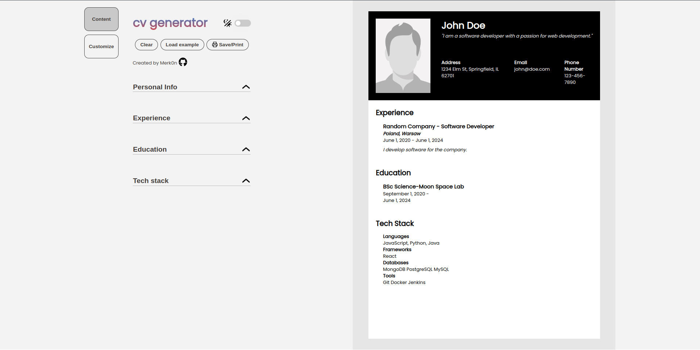
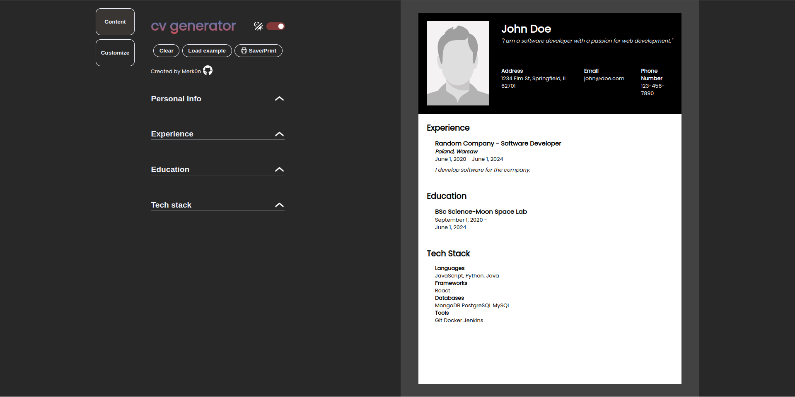
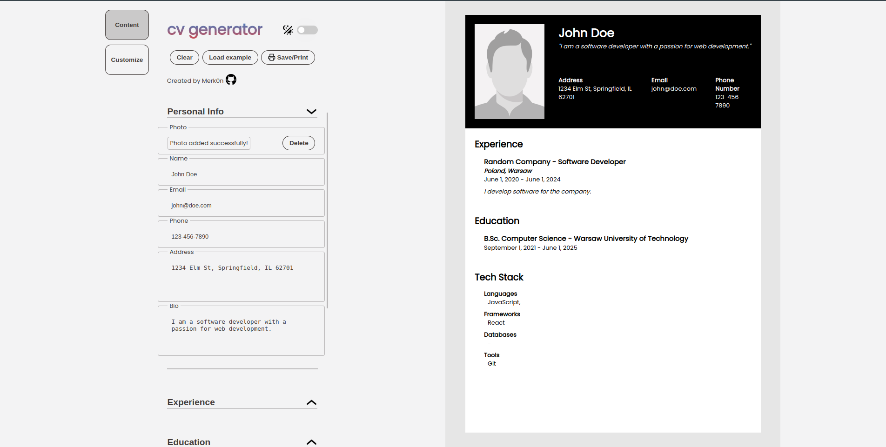
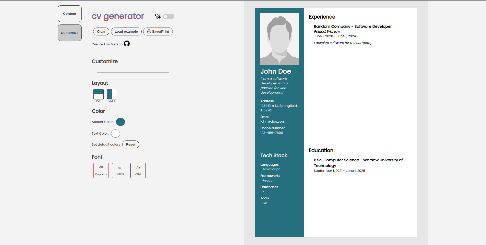

# CV-GENERATOR
This project is a CV (Curriculum Vitae) generator built using React and styled with CSS. The CV generator comprises two primary components: the control section and the visualization section. Within the control section, users can input, modify, or remove their details. Any information entered here instantly reflects in the visualization section. Upon completion, users can conveniently download their CV in PDF with proper formatting.

## Demo
**[Live preview](https://merk0n.github.io/cv-generator/)**

CV - light theme            |  CV - dark theme
:-------------------------:|:-------------------------:
  |  

Content form            |  Customize form
:-------------------------:|:-------------------------:
  |  

## Features

- Light/dark mode toggle
- On change live preview
- Picture upload
- Responsive design
- Load random example
- Clear data
- Save/print CV
- Customize CV
  - set layout,
  - set accent color,
  - set font style

## 🛠 Built using
React, Vanillia CSS

